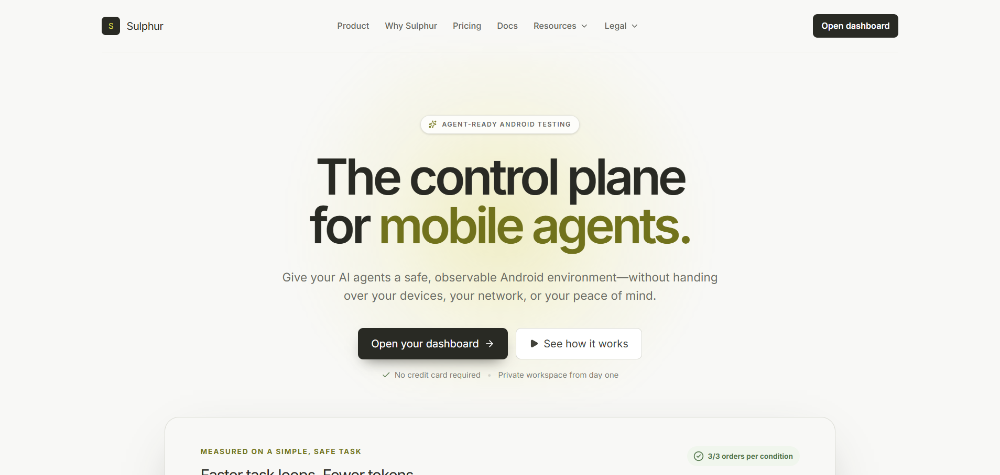
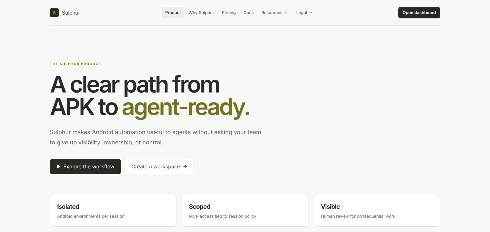
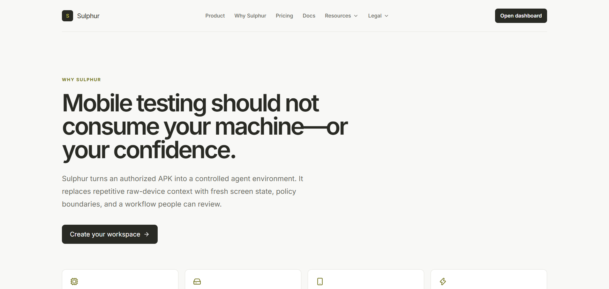
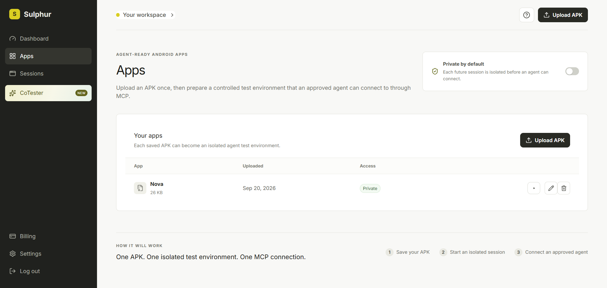
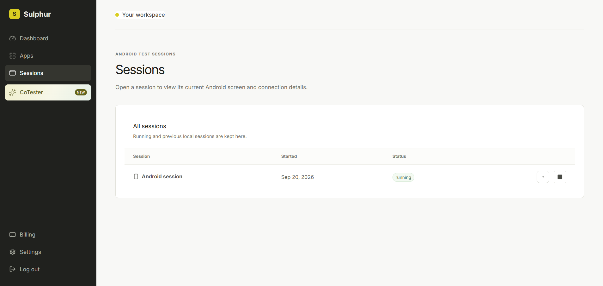
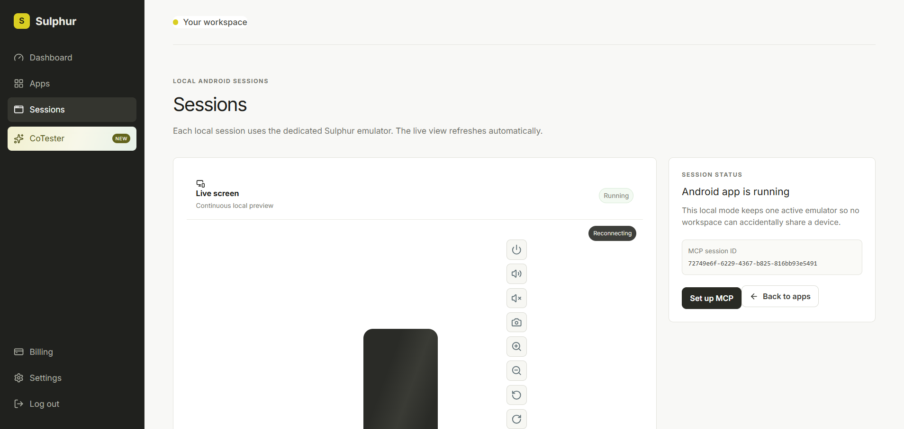
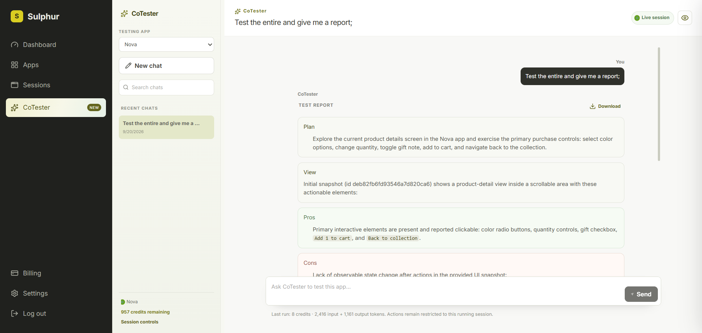
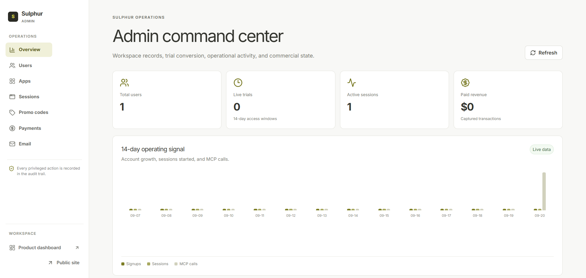

# Sulphur

## Overview

Sulphur is an AI-assisted Android app testing workspace. Teams upload an APK, start an isolated local Android session, and ask **CoTester** to test real in-app flows through a chat-first interface. CoTester uses a restricted session tool surface, observes the UI, performs snapshot-bound actions, and saves evidence-based reports with token-priced AI credits.

## Problem Statement

Mobile app testing is often fragmented between manual emulator work, scripts that break when screens change, and bug reports without reproducible evidence. Small product teams need a safe way to describe a test in plain language while retaining control of the app, device, data, and cost.

## Solution

Sulphur combines an APK library, one-session-at-a-time Android runtime, scoped MCP-compatible device tools, and CoTester. A user can say “test the purchase flow” instead of manually driving every screen. CoTester plans the run, inspects the screen, acts only against current UI snapshot elements, verifies outcomes, and writes a durable report with clear pros, cons, and next steps.

## Features

- Email/password authentication with verified email, Google, and GitHub options.
- Private APK upload, validation, named app library, app editing, and deletion.
- Configurable app defaults: clean start, session duration, orientation, retention, and network access.
- A local Android emulator worker that starts ADB only when a session needs it, installs the selected APK, and opens it automatically.
- One active Android session at a time for predictable isolation.
- Session list, live screenshot preview, fullscreen phone frame, device controls, end, delete, and restart-from-the-same-APK actions.
- Session-scoped MCP-compatible capabilities for screen state, UI snapshots, screenshots, relaunching, snapshot-bound actions, and limited lifecycle controls.
- CoTester chat workspace with app selection, persistent conversation history, search, rename, delete, resizable history rail, and live app preview.
- Durable database-backed CoTester queue: queued/running/succeeded/failed state survives browser refreshes and server recovery.
- Live CoTester activity feed with planning, tool usage, blocked steps, analysis, and report completion.
- OpenAI Responses API integration with tool calling, visual context, bounded tool runs, durable conversation summaries, and credit usage calculated from input/output tokens.
- Markdown reports with tables, separate Plan/View/Pros/Cons/Next steps cards, and Markdown report download.
- Credit balance, billing history, promo-code support, usage metrics, workspace settings, MCP settings, email preferences, and admin controls.
- Responsive public marketing pages: landing page, product, why Sulphur, pricing, resources, documentation, and legal pages.
- Vercel marketing deployment configuration that intentionally keeps local Android and private API features off the public static site.

## Tech Stack

- **Frontend:** React, TypeScript, Vite, React Router, React Markdown + GitHub-Flavored Markdown.
- **UI / UX:** Lucide icons, Radix-backed shadcn-style primitives, custom responsive CSS, accessible dialogs, toasts, loading states, and phone preview frame.
- **Backend:** Hono running on Node.js, Better Auth, server-sent events for run activity, and a durable in-process queue worker.
- **Database:** PostgreSQL/Supabase-compatible schema for users, apps, Android sessions, credit ledger, CoTester conversations, queued runs, and activity events.
- **Android runtime:** Android SDK/AVD, ADB, local emulator worker, APK install/launch, UI Automator snapshots, and PNG screen capture.
- **APIs / Services:** OpenAI Responses API, Stripe (billing-ready), SMTP (email-ready), Google/GitHub OAuth (optional).
- **Hosting / Deployment:** Vercel hosts the public marketing experience; the authenticated API, database, Android emulator, ADB, and CoTester worker run locally or on a future dedicated worker host.
- **Other tools:** Docker Compose configuration for the Android worker, Vitest for tests, TypeScript build checks, GitHub project support, and Vercel CLI deployment.

## Codex / OpenAI Usage

This project was built with **OpenAI Codex** as an active development partner. I used Codex for the product idea and architecture, the React/Hono/Postgres implementation, the Nova Android demo app, emulator and API debugging, chat UX iteration, build/test validation, and this documentation. It made the hackathon build substantially faster by keeping implementation, debugging, testing, and presentation work in one iterative workflow.

**CoTester** brings that agentic workflow into Sulphur. It uses the OpenAI Responses API with a restricted, session-scoped MCP tool surface: it receives compact owner-scoped context, inspects the Android UI, takes visual evidence when needed, and performs only snapshot-bound actions. Input and output tokens are converted into Sulphur AI credits after each completed run. The aim is to make building and testing Android apps faster and cheaper: less repeated device context for the model, fewer manual emulator loops for the maker, and a clear evidence-based report at the end.

## Benchmark: CoTester MCP workflow vs. direct ADB

The product includes a small, repeatable benchmark of the same safe three-order task. Each condition completed all three orders and returned to Home with an empty cart. The optimized CoTester MCP workflow avoids repeatedly sending raw UI dumps by returning a refreshed, named screen snapshot after each action.

| Condition | Task time | Input tokens | Output tokens | Result |
| --- | ---: | ---: | ---: | --- |
| Direct ADB | 207.93 s | 531,673 | 3,883 | 3/3 orders |
| MCP with redundant snapshots | 220.69 s | 491,216 | 2,318 | 3/3 orders |
| **CoTester MCP with optimized snapshots** | **160.42 s** | **358,789** | **1,275** | **3/3 orders** |

On this task, optimized snapshots were **1.30× faster** than direct ADB, with **32.5% fewer input tokens** and **67.2% fewer output tokens**. This is a focused product benchmark—not a universal claim about every app, model, device, or test flow—but it shows why compact MCP context can lower cost and speed up agent-driven testing.

## Demo

### Live Demo

- Vercel marketing site: [sulphur.zydcode.in](https://sulphur.zydcode.in)
- Vercel deployment: [production deployment](https://sulphur-marketing-dbgtvlq9o-razin-developers-projects.vercel.app)
- Local product app: `http://localhost:5173`

### Demo / Pitch Video

[Watch the Sulphur demo recording](./docs/demo/sulphur-demo.mp4)

The recording walks through the local product experience: Nova APK testing, automatic emulator startup, a CoTester request, live activity, and the final report.

## Screenshots

### Landing page



### Product workflow



### Why Sulphur



### App library



### Sessions



### Live Android session



### CoTester report



### Admin command center



## How to Run Locally

Prerequisites: Node.js 20+, PostgreSQL/Supabase connection, Android Studio SDK, and an AVD named `Sulphur_API_30` (or `SULPHUR_AVD_NAME`).

```bash
git clone https://github.com/Razin-developer/sulphur.git
cd sulphur
npm run local
```

`npm run local` installs dependencies when needed, creates a safe `.env` template if one is missing, runs database migrations, then starts both the API and Vite app. It never copies, prints, or distributes secrets. Fill the local `.env` values before running it again; `OPENAI_API_KEY` is required only for CoTester runs.

You do not need to manually start ADB or the emulator. Sulphur starts the local Android device when a session is requested.

### Private one-command bootstrap

The Vercel deployment can serve an installer that clones the project, requests the private installer password, writes the managed `.env`, installs locked dependencies, starts ADB and the configured emulator, runs migrations, and starts the API, CoTester queue worker, and frontend. The queue worker is part of the API process. During setup it asks you to run Stripe's `stripe listen` command in another terminal and paste its `whsec_...` signing secret. The password and environment bundle are Vercel production environment variables; they are never committed to Git or sent to the browser.

PowerShell:

```powershell
irm https://sulphur.zydcode.in/install.ps1 | iex
```

macOS/Linux:

```bash
curl -fsSL https://sulphur.zydcode.in/install.sh | bash
```

The installer is intentionally private. Before deploying, configure `INSTALLER_PASSWORD` (set it to `123rusk` if that is the password you want) and `SULPHUR_ENV_BUNDLE_B64` in Vercel Production. The latter is the base64-encoded contents of your local `.env`. Rotate any included credentials if the installer password is shared or lost.

## Additional Notes

### What is intentionally absent from the Vercel demo

Vercel hosts the public landing/resource/legal pages only. The private product experience needs a long-running Node API, PostgreSQL, Android SDK, ADB/emulator access, APK storage, and an OpenAI-enabled CoTester worker, which do not run inside a static Vercel deployment. Those services run locally today.

### Future plans

- Deploy the API and queue worker to a dedicated secure runtime with a managed Android device pool.
- Add parallel device capacity, device/OS selection, test scheduling, team collaboration, and CI-triggered runs.
- Persist screenshots and structured artifacts per test step, with shareable reports and issue-tracker exports.
- Add test suites, reusable test plans, regression comparison, accessibility checks, and visual diffs.
- Improve model-assisted issue triage, suggested fixes, and human approval gates for sensitive workflows.
- Connect CoTester directly to a hosted MCP deployment while preserving owner/session boundaries.

### Security note

Secrets—including database passwords, OAuth credentials, Stripe keys, and `OPENAI_API_KEY`—must remain in local or managed environment variables. The project includes a safe `.env.example`; the optional private bootstrap service reads the real `.env` only from protected Vercel environment variables after password verification.
